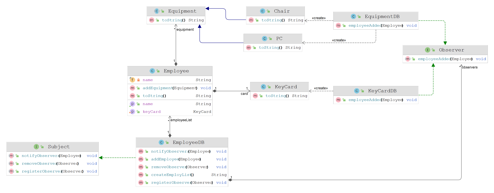

## Exercise 306 Observer Employee Management

Imagine a company running a lot of different databases for their employees, their PCs, KeyCards etc. 

When now an employee is hired, the company needs to assign a chair, a PC and a KeyCard to the
new employee.

The steps are:
1. Add the employee to the employee database (EmployeeDB)
2. Create a chair and a PC for the employee (EquipmentDB)
3. Create a KeyCard for the employee (KeyCardDB)

What if in the future additional databases should be connected to this process?
E.g. a ParkingLotDB for assigning a parking lot to the employee.

The solution is to use the Observer pattern. The EmployeeDB is the subject and the other
databases are the observers. When the EmployeeDB is changed, the observers are notified and
can react to the change.

---

The Observer pattern is a software design pattern in which an object, called the subject, maintains 
a list of its dependents, called observers, and notifies them automatically of any state changes, 
usually by calling one of their methods. It is mainly used to implement distributed event handling 
systems, in "event driven" software.

---

### Class Diagram

### Output

<pre>
Welcome to the Employee Management System
========================================
1. Add Employee
2. Print Employees
3. Export Employess To File
0. Quit
<b style="color:green">1</b>
Name: 
<b style="color:green">Gernot Loibner</b>
Date of Birth: 
<b style="color:green">1998-04-04</b>
Creating Chair for Gernot Loibner
Creating PC for Gernot Loibner
Creating Key Card for Gernot Loibner
========================================
1. Add Employee
2. Print Employees
3. Export Employess To File
0. Quit
<b style="color:green">1</b>
Name: 
<b style="color:green">Andreas Schwarzl</b>
Date of Birth: 
<b style="color:green">2000-01-01</b>
Creating Chair for Andreas Schwarzl
Creating PC for Andreas Schwarzl
Creating Key Card for Andreas Schwarzl
========================================
1. Add Employee
2. Print Employees
3. Export Employess To File
0. Quit
<b style="color:green">2</b>
Employee [name=Gernot Loibner, dateOfBirth=1998-04-04] [KeyCard [id=107684]] [Chair [color=Green] [serialNumber=164]] [PC [operatingSystem=Linux, processor=AMD Ryzen 5] [serialNumber=4591]]
Employee [name=Andreas Schwarzl, dateOfBirth=2000-01-01] [KeyCard [id=161189]] [Chair [color=Blue] [serialNumber=51]] [PC [operatingSystem=Linux, processor=Intel Core i3] [serialNumber=4414]]

</pre>
